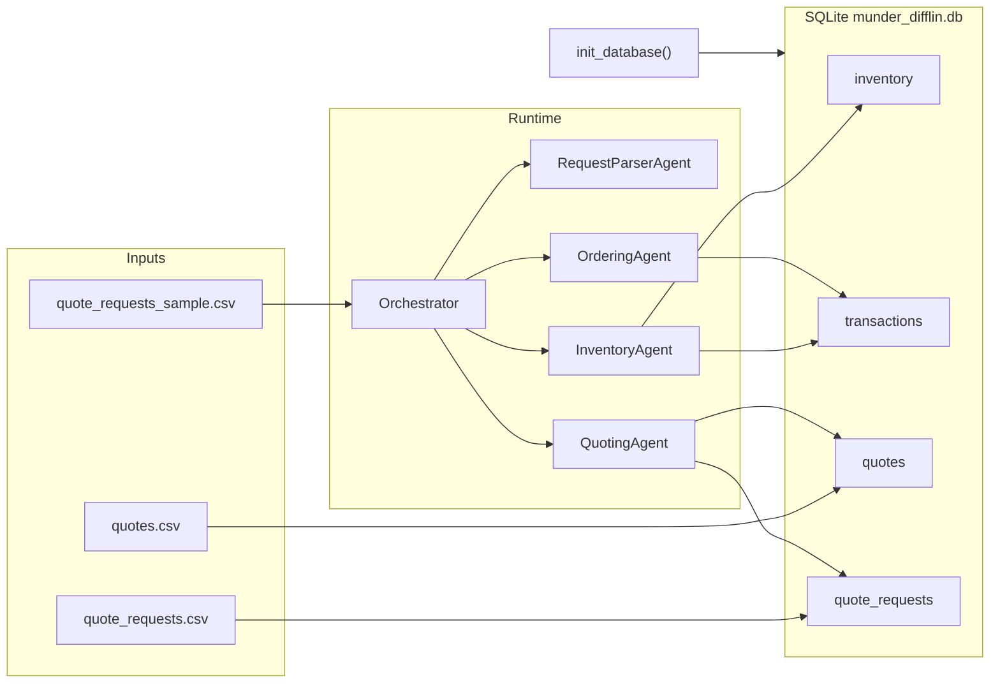

# System Design

Design notes for the Munder Difflin multi-agent system — satisfies submission checklist item 3 (see [Submission Checklist](./README.md#submission-checklist) in README).

## Architecture Overview

**Architecture** is the fundamental organization of a system: its components, their relationships to each other and the environment, and the principles governing its design.

| Layer | Components |
|-------|------------|
| **Agents (5)** | Orchestrator Agent, Request Parser / Item Mapper, Inventory Agent, Quoting Agent, Ordering Agent |
| **Persistence** | SQLite database (`munder_difflin.db`) — `inventory`, `transactions`, `quotes`, `quote_requests` |
| **Inputs** | `quote_requests_sample.csv` (test requests), `quote_requests.csv` + `quotes.csv` (historical seed data) |
| **Environment** | Vocareum OpenAI API via `smolagents`, configured in `.env` |
| **Principles** | ≤5 agents, text-only inter-agent communication, date-aware DB queries, exact catalog item names, bulk discounts on quotes |

The system automates inventory checks, quote generation, and order fulfillment for incoming customer requests. A centralized **Orchestrator Agent** delegates to four specialist workers — matching the **Orchestrator Pattern** from the course.

Workflow diagrams are in [WORKFLOW.md](./WORKFLOW.md).

## Architecture Pattern and Rules of Engagement

**Orchestrator Pattern (chosen):** One Orchestrator Agent is the single entry point for customer requests and the only agent that invokes specialists. Workers return text summaries; the Orchestrator decides the next step and composes the final customer-facing reply.

**Peer-to-Peer Pattern (not used):** In a P2P design, specialists could coordinate directly (e.g., Quoting Agent asking Inventory Agent for stock levels). This project avoids P2P to maintain a single control flow, prevent duplicate or conflicting database writes, and produce one coherent customer response per request.

**Rules of engagement:**

- All inter-agent messages are plain text — no shared Python objects between agents
- Every handoff includes the `request_date` so inventory and cash queries are date-accurate
- Only the **Ordering Agent** writes transactions (`stock_orders`, `sales`)
- Only the **Request Parser / Item Mapper** maps colloquial item names to exact catalog `item_name` values
- The **Orchestrator Agent** synthesizes the final outward-facing reply

## Agent Roles

| Agent | Role | Key tools (wrapping starter DB functions) |
|-------|------|-------------------------------------------|
| **Orchestrator Agent** | Single entry point; routes text between agents; composes final customer reply | Delegates via `smolagents` managed agents; no direct DB writes |
| **Request Parser / Item Mapper** | Extract quantities, delivery deadline, job/event context; map fuzzy names → exact `item_name` from `paper_supplies` | Read-only catalog lookup; outputs structured text payload for downstream agents |
| **Inventory Agent** | Check stock as-of request date; flag shortfalls vs `min_stock_level` | `get_all_inventory()`, `get_stock_level()` |
| **Quoting Agent** | Price line items; apply bulk discounts; reference past quotes | `search_quote_history()`, unit prices from `inventory` / `paper_supplies` |
| **Ordering Agent** | Fulfill sales; place supplier restocks; validate cash | `create_transaction()`, `get_cash_balance()`, `get_supplier_delivery_date()` |

> **Naming note:** Most workers follow a `[Domain] Agent` pattern. The Request Parser role omits "Agent" from its design-doc title because it is named by **pipeline function** (parse + map), not business domain. The slash form signals two coupled sub-tasks in one specialist. In code and diagrams it is implemented as `RequestParserAgent`.

### Orchestrator Agent

- **Input:** Raw customer request text with `request_date`
- **Output:** Final unified quote and order confirmation to the customer
- **Logic:** Sequences Parser → Inventory + Quoting (parallel) → Ordering; handles failures from any specialist
- **Failure mode:** If a specialist reports an error, Orchestrator returns a clear explanation to the customer instead of partial data

### Request Parser / Item Mapper (`RequestParserAgent`)

- **Input:** Full natural-language request from Orchestrator
- **Output:** Structured text — exact `item_name`, quantity per line, delivery deadline, job/event context
- **Logic:** Match colloquial names (e.g., "8.5x11 colored paper", "poster boards") to catalog entries (`Colored paper`, `Large poster paper (24x36 inches)`)
- **Failure mode:** Unknown or ambiguous items → return a list of unresolved names so Orchestrator can ask the customer to clarify

### Inventory Agent

- **Input:** Parsed line items + `request_date`
- **Output:** Availability report — in-stock, shortfall quantities, restock recommendations
- **Logic:** Restock qty = shortfall + buffer to reach `min_stock_level` when below threshold
- **Failure mode:** Item not in catalog → flag for Parser/Orchestrator (not an inventory issue)

### Quoting Agent

- **Input:** Parsed line items + job/event context + `request_date`
- **Output:** Priced quote draft with bulk discount rationale
- **Logic:** Look up similar past quotes via `search_quote_history()`; apply unit prices and volume discounts; round totals per historical patterns in `quotes.csv`
- **Failure mode:** No matching history → fall back to standard unit prices with a default bulk discount tier

### Ordering Agent

- **Input:** Fulfill and optional restock instructions + `request_date`
- **Output:** Transaction IDs, supplier delivery ETA, updated cash status
- **Logic:** Validate cash via `get_cash_balance()` before `stock_orders`; record `sales` on fulfillment; compute delivery via `get_supplier_delivery_date()`
- **Failure mode:** Insufficient cash → reject restock and report shortfall to Orchestrator

## Data Sources and Persistence

- `init_database()` loads historical CSVs, seeds $50,000 starting cash, and creates initial `stock_orders` for ~40% of catalog items (seed 137)
- Only exact `item_name` values succeed in `create_transaction()` — the Parser is critical for avoiding transaction failures

## Key Design Decisions

- **Dedicated Parser specialist** — sample requests use colloquial names that must map to exact catalog entries before any DB operation
- **Quote history for pricing** — `search_quote_history()` matches job/event/size keywords from `quotes.csv` metadata to inform bulk discount tiers
- **Date-aware inventory** — all stock and cash queries use the request date (not "today") so sequential test scenarios in `quote_requests_sample.csv` stay consistent
- **Restock before fulfill** — when stock is insufficient and cash allows, Ordering places `stock_orders` then `sales` on the same date; delivery ETA from `get_supplier_delivery_date()` is included in the customer reply

## Data Flow

**Data flow** is the path data takes through the system, moving from one agent to another:

1. **Customer → Orchestrator:** raw request + `request_date`
2. **Orchestrator → Parser:** full request text
3. **Parser → Orchestrator:** structured line items (exact `item_name`, qty, deadline)
4. **Orchestrator → Inventory / Quoting (parallel):** parsed items + date
5. **Inventory → Orchestrator:** availability report + restock recommendations
6. **Quoting → Orchestrator:** priced quote with bulk discount rationale
7. **Orchestrator → Ordering:** fulfill + optional restock instructions
8. **Ordering → Orchestrator:** transaction IDs, delivery ETA, cash status
9. **Orchestrator → Customer:** unified quote + order confirmation

See [WORKFLOW.md](./WORKFLOW.md) for [sequence](./WORKFLOW.md#per-request-sequence) and [architecture](./WORKFLOW.md#high-level-architecture) diagrams.

## Tool-to-Function Mapping

| Agent | Planned tool | Starter function in `project_starter.py` |
|-------|-------------|----------------------------------------|
| Inventory Agent | Check all stock as of date | `get_all_inventory(as_of_date)` |
| Inventory Agent | Check single item stock | `get_stock_level(item_name, as_of_date)` |
| Quoting Agent | Search past quotes | `search_quote_history(search_terms, limit)` |
| Ordering Agent | Record sale or restock | `create_transaction(item_name, type, qty, price, date)` |
| Ordering Agent | Validate available cash | `get_cash_balance(as_of_date)` |
| Ordering Agent | Estimate supplier delivery | `get_supplier_delivery_date(input_date, quantity)` |
| Orchestrator Agent | Generate end-of-run report | `generate_financial_report(as_of_date)` |
| All | DB initialization at startup | `init_database(db_engine)` |

**Framework:** `smolagents` — specialists as `CodeAgent` or `ToolCallingAgent`; Orchestrator as manager with `managed_agents`. LLM via Vocareum OpenAI (see [`.env.example`](./.env.example) / [VOCAREUM_SETUP.md](./VOCAREUM_SETUP.md)).
