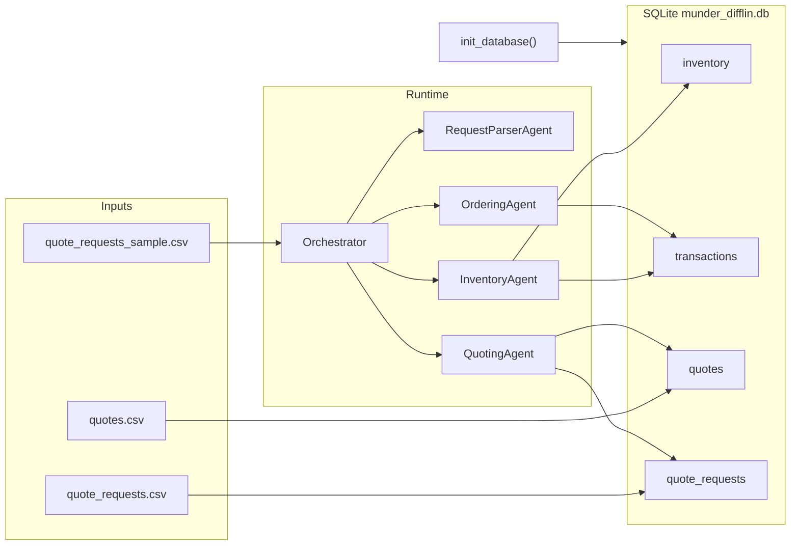

# System Design

Design notes for the Munder Difflin multi-agent system (submission checklist item 3; see [Submission Checklist](./README.md#submission-checklist)).

## Architecture Overview

| Layer | Components |
|-------|------------|
| **Agents (5)** | Orchestrator Agent, Request Parser / Item Mapper, Inventory Agent, Quoting Agent, Ordering Agent |
| **Persistence** | SQLite database (`munder_difflin.db`): `inventory`, `transactions`, `quotes`, `quote_requests` |
| **Inputs** | `quote_requests_sample.csv` (test requests), `quote_requests.csv` + `quotes.csv` (historical seed data) |
| **Environment** | Vocareum OpenAI API via `smolagents`, configured in `.env` |
| **Principles** | Max 5 agents, text-only inter-agent communication, date-aware DB queries, exact catalog item names, bulk discounts on quotes |

The system automates inventory checks, quote generation, and order fulfillment for incoming customer requests. A centralized **Orchestrator Agent** delegates to four specialist workers using the Orchestrator Pattern from the course.

Workflow diagrams are in [WORKFLOW.md](./WORKFLOW.md).

## Architecture Pattern and Rules of Engagement

**Orchestrator Pattern (chosen):** One Orchestrator Agent is the single entry point for customer requests and the only agent that invokes specialists. Workers return text summaries; the Orchestrator decides the next step and composes the final customer-facing reply.

**Peer-to-Peer Pattern (not used):** In a P2P design, specialists could coordinate directly (e.g., Quoting Agent asking Inventory Agent for stock levels). This project avoids P2P to maintain a single control flow, prevent duplicate or conflicting database writes, and produce one coherent customer response per request.

**Rules of engagement:**

- All inter-agent messages are plain text; no shared Python objects between agents
- Every handoff includes the `request_date` so inventory and cash queries are date-accurate
- Only the **Ordering Agent** writes transactions (`stock_orders`, `sales`)
- Only the **Request Parser / Item Mapper** maps colloquial item names to exact catalog `item_name` values
- The **Orchestrator Agent** synthesizes the final outward-facing reply

## Routing Strategy

The Orchestrator Agent routes all customer requests. The main pattern is **content-based routing**: inspect message content at each step and decide where it goes next.

### Routing patterns

| Pattern | Role in this system |
|---------|---------------------|
| **Content-based routing (primary)** | Orchestrator inspects Parser output and specialist reports to decide whether to clarify, price, restock, or report failure |
| **Round-robin routing (not used)** | One instance of each specialist; `run_test_scenarios()` processes requests sequentially. Round-robin is for scaling identical agents; not applicable with max 5 agents |
| **Priority-based routing (secondary)** | Parsed `delivery deadline` sets urgency flags in Orchestrator handoffs (e.g., expedited restock messaging when the deadline is tight). Enhances routing decisions; does not require a separate agent |

### Routing decision table

| Condition | Route to | Action |
|-----------|----------|--------|
| Parser returns unresolved items | Customer (via Orchestrator) | Ask for clarification |
| Parsed items valid | Inventory + Quoting (parallel) | Availability + pricing |
| Stock shortfall, cash OK | Ordering | `stock_orders` then `sales` |
| Stock shortfall, cash insufficient | Customer (via Orchestrator) | Failure report |
| Specialist error | Customer (via Orchestrator) | Failure report |

See the [routing decisions diagram](./WORKFLOW.md#routing-decisions) in WORKFLOW.md.

## State Management

Agents need context to operate. The Orchestrator manages shared state and passes only the relevant pieces to each specialist.

### Conversation-level state (per request)

- The Orchestrator holds request context: raw request, parsed items, inventory report, quote draft, ordering result
- Context is passed forward as text at each handoff; no shared Python objects between agents
- `request_date` anchors all date-scoped queries within a request

### System-level state (across requests)

- SQLite (`munder_difflin.db`) is the source of truth for inventory, cash, transactions, and quote history
- `run_test_scenarios()` processes requests sorted by date so system state evolves realistically across the test run
- `generate_financial_report()` reads cumulative system state after each request

Coordination rules that protect system state: only the **Ordering Agent** writes transactions; only the **Request Parser / Item Mapper** maps colloquial names to exact catalog `item_name` values.

Orchestration mechanics and smolagents coding patterns are in [IMPLEMENTATION.md](./IMPLEMENTATION.md).

See the [state layers diagram](./WORKFLOW.md#state-layers) in WORKFLOW.md.

## Failure Handling and Recovery

| Strategy | Application in Munder Difflin |
|----------|-------------------------------|
| **Retry logic** | Orchestrator re-invokes a specialist once on transient LLM/tool errors before escalating |
| **Fallback / alternative paths** | Quoting falls back to standard unit prices when `search_quote_history()` returns no match; Ordering skips restock if cash is insufficient but still attempts sale if stock allows |
| **Clear failure reporting** | Orchestrator returns one clear customer-facing message; no partial quotes or phantom orders |
| **Compensating actions** | If `sales` fails after a successful `stock_orders`, Orchestrator reports the restock cost and does not claim fulfillment. Ordering validates cash before writes to reduce this risk |
| **Human-in-the-loop escalation** | When the Parser returns unresolved items, Orchestrator asks the customer to clarify item names |

## Multi-Agent State Coordination

When multiple agents operate on shared data, they need a consistent view of world state and rules for resolving contradictions.

Agents access shared state only through `@tool` functions (Lesson 6 pattern), with SQLite as the store rather than an in-memory singleton.

| Mechanism | Application in Munder Difflin |
|-----------|-------------------------------|
| **Database as source of truth (primary sync)** | All agents read inventory, cash, and quotes via starter DB functions scoped to `request_date`. Only the Ordering Agent writes, which avoids write conflicts |
| **Predefined rules / policies (conflict resolution)** | Single-writer policy for transactions; Parser wins on item name mapping; Orchestrator merges conflicting specialist reports (e.g., if Quoting prices an item Inventory flagged as unavailable, both facts go to the customer) |
| **Optimistic concurrency** | Sequential test processing (one request at a time) avoids concurrent write races. Production would need transaction isolation or row locking on `create_transaction()` |
| **State broadcasting / eventing (not used)** | Not needed; Orchestrator mediates all communication and DB reads are on-demand per request |
| **Rollback and retry** | If a DB write fails (bad `item_name`, constraint error), Ordering returns error text; Orchestrator does not retry the write blindly and may route back to the Parser if a name mismatch is suspected |
| **Human escalation** | Ambiguous catalog matches escalated to customer via Orchestrator (see routing decision table above) |

Avoiding the Peer-to-Peer pattern (see above) keeps a single control flow and one transaction writer, so specialists do not issue conflicting updates.

## Agent Roles

| Agent | Role | Key tools (wrapping starter DB functions) |
|-------|------|-------------------------------------------|
| **Orchestrator Agent** | Single entry point; routes text between agents; composes final customer reply | Delegates via `smolagents` (wrapper tools or `managed_agents`); no direct DB writes |
| **Request Parser / Item Mapper** | Extract quantities, delivery deadline, job/event context; map fuzzy names to exact `item_name` from `paper_supplies` | Read-only catalog lookup; outputs structured text for other agents |
| **Inventory Agent** | Check stock as-of request date; flag shortfalls vs `min_stock_level` | `get_all_inventory()`, `get_stock_level()` |
| **Quoting Agent** | Price line items; apply bulk discounts; reference past quotes | `search_quote_history()`, unit prices from `inventory` / `paper_supplies` |
| **Ordering Agent** | Fulfill sales; place supplier restocks; validate cash | `create_transaction()`, `get_cash_balance()`, `get_supplier_delivery_date()` |

The Request Parser is titled by pipeline function (parse + map) rather than domain name. In code and diagrams it is `RequestParserAgent`.

### Orchestrator Agent

- **Input:** Raw customer request text with `request_date`
- **Output:** Final unified quote and order confirmation to the customer
- **Logic:** Parser, then Inventory + Quoting in parallel, then Ordering; handles failures from any specialist
- **Failure mode:** Re-invokes a specialist once on transient errors; if a specialist still reports an error, returns a clear explanation to the customer instead of partial data

### Request Parser / Item Mapper (`RequestParserAgent`)

- **Input:** Full natural-language request from Orchestrator
- **Output:** Structured text: exact `item_name`, quantity per line, delivery deadline, job/event context
- **Logic:** Match colloquial names (e.g., "8.5x11 colored paper", "poster boards") to catalog entries (`Colored paper`, `Large poster paper (24x36 inches)`)
- **Failure mode:** Unknown or ambiguous items: return unresolved names so Orchestrator can ask the customer to clarify

### Inventory Agent

- **Input:** Parsed line items + `request_date`
- **Output:** Availability report: in-stock, shortfall quantities, restock recommendations
- **Logic:** Restock qty = shortfall + buffer to reach `min_stock_level` when below threshold
- **Failure mode:** Item not in catalog: flag for Parser/Orchestrator (not an inventory issue)

### Quoting Agent

- **Input:** Parsed line items + job/event context + `request_date`
- **Output:** Priced quote draft with bulk discount rationale
- **Logic:** Look up similar past quotes via `search_quote_history()`; apply unit prices and volume discounts; round totals per historical patterns in `quotes.csv`
- **Failure mode:** No matching history: fall back to standard unit prices with a default bulk discount tier

### Ordering Agent

- **Input:** Fulfill and optional restock instructions + `request_date`
- **Output:** Transaction IDs, supplier delivery ETA, updated cash status
- **Logic:** Validate cash via `get_cash_balance()` before `stock_orders`; record `sales` on fulfillment; compute delivery via `get_supplier_delivery_date()`
- **Failure mode:** Insufficient cash: reject restock and report shortfall to Orchestrator

## Data Sources and Persistence

- `init_database()` loads historical CSVs, seeds $50,000 starting cash, and creates initial `stock_orders` for ~40% of catalog items (seed 137)
- Only exact `item_name` values succeed in `create_transaction()`; the Parser is critical for avoiding transaction failures

## Key Design Decisions

- **Dedicated Parser specialist:** sample requests use colloquial names that must map to exact catalog entries before any DB operation
- **Quote history for pricing:** `search_quote_history()` matches job/event/size keywords from `quotes.csv` metadata to inform bulk discount tiers
- **Date-aware inventory:** all stock and cash queries use the request date (not "today") so sequential test scenarios in `quote_requests_sample.csv` stay consistent
- **Restock before fulfill:** when stock is insufficient and cash allows, Ordering places `stock_orders` then `sales` on the same date; delivery ETA from `get_supplier_delivery_date()` is included in the customer reply

## Data Flow

1. **Customer to Orchestrator:** raw request + `request_date`
2. **Orchestrator to Parser:** full request text
3. **Parser to Orchestrator:** structured line items (exact `item_name`, qty, deadline)
4. **Orchestrator to Inventory / Quoting (parallel):** parsed items + date
5. **Inventory to Orchestrator:** availability report + restock recommendations
6. **Quoting to Orchestrator:** priced quote with bulk discount rationale
7. **Orchestrator to Ordering:** fulfill + optional restock instructions
8. **Ordering to Orchestrator:** transaction IDs, delivery ETA, cash status
9. **Orchestrator to Customer:** unified quote + order confirmation

### Data flow management

The Orchestrator reshapes data at each handoff so specialists get only what they need: enhancement (add related info), filtering (drop unnecessary fields), or reformatting (change structure).

| Handoff | Enhancement | Filtering | Reformatting |
|---------|-------------|-----------|--------------|
| Customer to Orchestrator | Append `request_date` | n/a | Raw NL request |
| Orchestrator to Parser | Include full request + date | n/a | n/a |
| Parser to Orchestrator | Exact `item_name`, qty, deadline, job context | Drop colloquial names | NL to structured text |
| Orchestrator to Inventory | `request_date`, line items only | No pricing/history | n/a |
| Orchestrator to Quoting | Job/event context for history search | No stock levels | n/a |
| Orchestrator to Ordering | Restock qty + sale prices from prior steps | Only actionable items | Combined fulfill instructions |
| Orchestrator to Customer | Quote + delivery ETA + order summary | Internal agent errors (unless relevant) | Unified customer reply |

Diagrams in [WORKFLOW.md](./WORKFLOW.md): [sequence](./WORKFLOW.md#per-request-sequence), [architecture](./WORKFLOW.md#high-level-architecture), [routing decisions](./WORKFLOW.md#routing-decisions), [state layers](./WORKFLOW.md#state-layers).

## Tool-to-Function Mapping

| Agent | Planned tool | Starter function in `project_starter.py` |
|-------|-------------|----------------------------------------|
| Inventory Agent | Check all stock as of date | `get_all_inventory(as_of_date)` |
| Inventory Agent | Check single item stock | `get_stock_level(item_name, as_of_date)` |
| Quoting Agent | Search past quotes | `search_quote_history(search_terms, limit)` |
| Ordering Agent | Record sale or restock | `create_transaction(item_name, type, qty, price, date)` |
| Ordering Agent | Validate available cash | `get_cash_balance(as_of_date)` |
| Ordering Agent | Estimate supplier delivery | `get_supplier_delivery_date(input_date, quantity)` |
| Orchestrator Agent | Generate end-of-run report | `generate_financial_report(as_of_date)` |
| All | DB initialization at startup | `init_database(db_engine)` |

**Framework:** `smolagents`: specialists as `CodeAgent` or `ToolCallingAgent`; Orchestrator delegates via `managed_agents` or wrapper `@tool` functions that call `self.<specialist>.run(text)`—both satisfy orchestrator-only delegation. [IMPLEMENTATION.md](./IMPLEMENTATION.md) documents this wrapper-tool pattern (course Lessons 3 and 5; Lesson 6 reinforces the same orchestration with in-memory `factory_state`, which this project replaces with SQLite). LLM via Vocareum OpenAI (see [`.env.example`](./.env.example) / [VOCAREUM_SETUP.md](./VOCAREUM_SETUP.md)).
