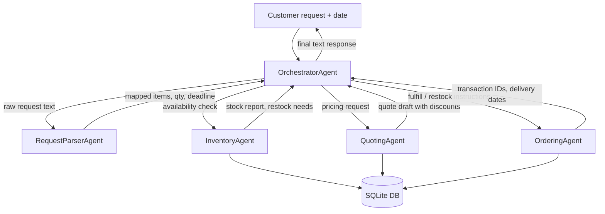
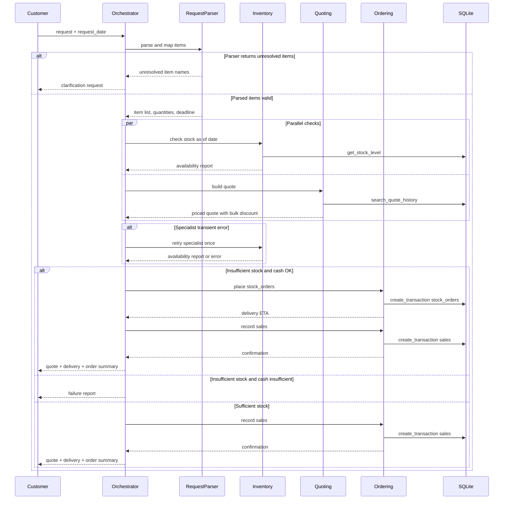
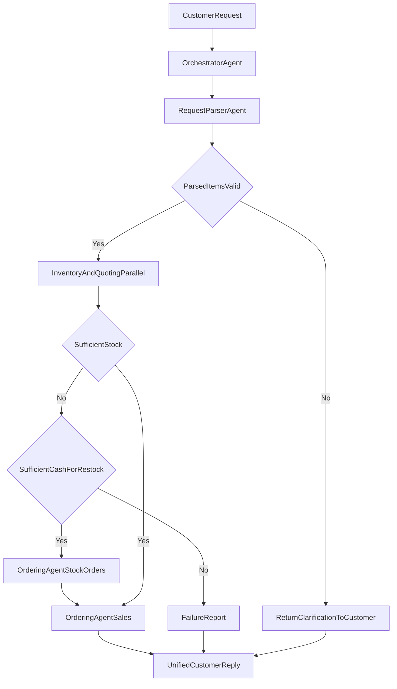
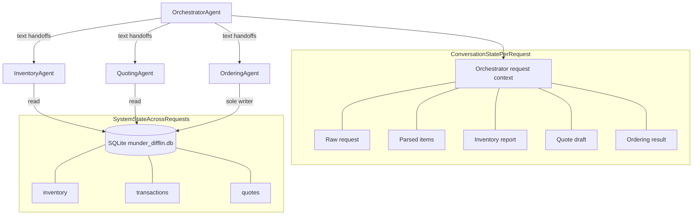
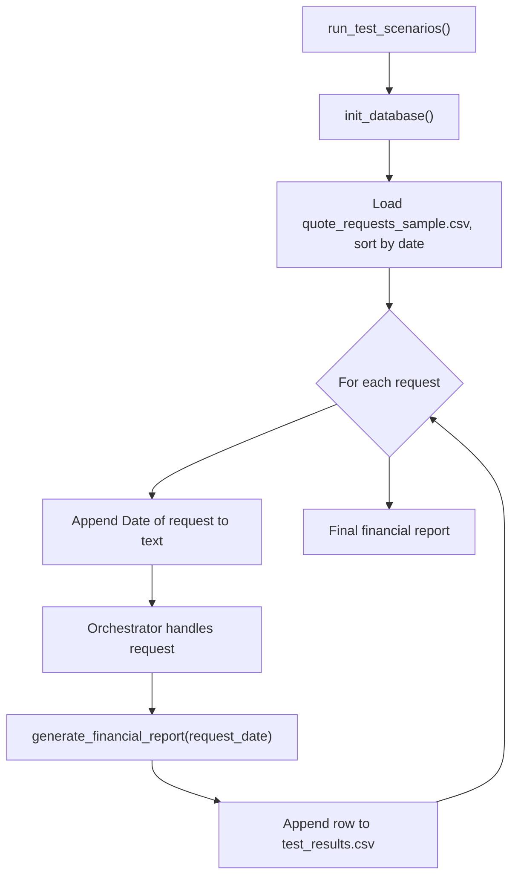

# Workflow

Workflow diagrams for the Munder Difflin multi-agent system (submission checklist item 2; see [Submission Checklist](./README.md#submission-checklist)).

Design narrative and agent roles are in [DESIGN.md](./DESIGN.md).

## High-Level Architecture

All specialist communication routes through the Orchestrator Agent.

## Per-Request Sequence

Message flow for one customer request: parallel inventory and quoting, parser clarification, specialist retry, restock branches, and failure paths.

## Routing Decisions

The Orchestrator inspects Parser output and specialist reports to decide the next step. Details in [DESIGN.md routing strategy](./DESIGN.md#routing-strategy).

## State Layers

Conversation-level state lives in the Orchestrator during a request; system-level state persists in SQLite across requests. Details in [DESIGN.md state management](./DESIGN.md#state-management).

## Test Run Loop

How `run_test_scenarios()` in `project_starter.py` drives the system across sample requests.

