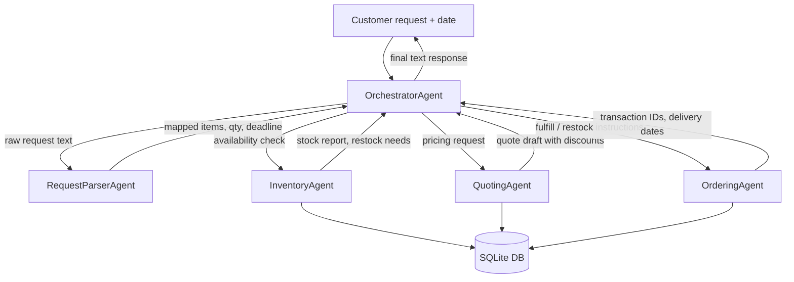
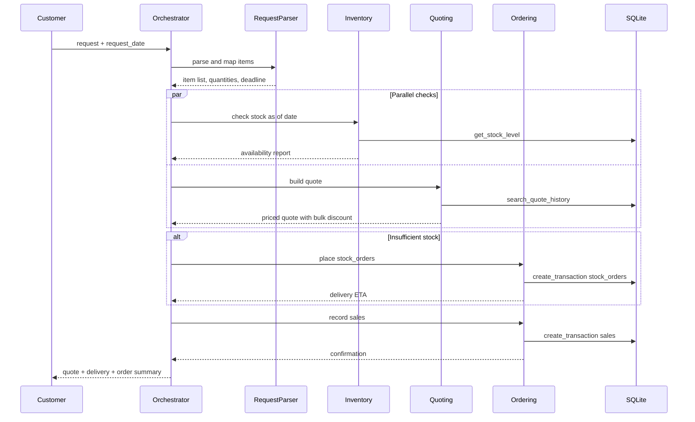
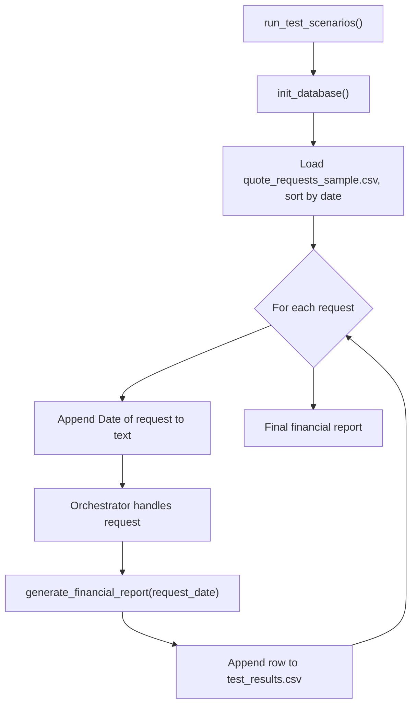

# Workflow

Workflow diagrams for the Munder Difflin multi-agent system — satisfies submission checklist item 2 (see [Submission Checklist](./README.md#submission-checklist) in README).

Design narrative and agent roles are in [DESIGN.md](./DESIGN.md).

## High-Level Architecture

Shows the Orchestrator Pattern: all specialist communication routes through the Orchestrator Agent.

## Per-Request Sequence

Shows the step-by-step message flow for a single customer request, including parallel inventory/quoting checks and the restock branch.

## Test Run Loop

Shows how `run_test_scenarios()` in `project_starter.py` drives the multi-agent system across all sample requests.

